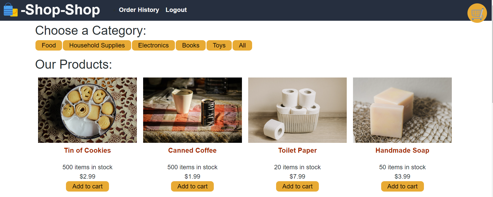

# Store - REDUX Store

<p align='center'>

</p>


## Overview

Welcome to the Redux Store, a simple e-commerce application showcasing the integration of Redux for state management. This project serves as a demonstration of how Redux can be implemented to manage and update the global state of a React application efficiently.


## Technologies Used

- [Redux](https://redux.js.org/)
- [Express](https://expressjs.com/)
- [GraphQL](https://graphql.org/learn/)
- [Stripe](https://stripe.com/docs)
- [React DOM](https://react.dev/reference/react-dom)
- [React Router DOM](https://reactrouter.com/en/main)


## Installation

1. Clone the repository to your local machine
``` bash
git clone https://github.com/dsatpm/REDUX-store.git
```
2. Navigate to the directory
``` bash
cd REDUX-store
```
3. Install dependencies
``` bash
npm install
```
4. Run the development server
``` bash
npm run develop
```
The Redux Store app will be available at `http://localhost:3000/` in your browser


## Features

### Global State Management
Utilize Redux to manage the application's state in a centralized store, making state updates more predictable and manageable.
### Redux Toolkit
Employ the Redux Toolkit, a set of tools and utilities to simplify common Redux use cases, improving the developer experience.
### React-Redux Integration
Integrate `react-redux` to connect React components to the Redux store, facilitating the flow of state updates within the application.
### Redux DevTools Extension
Enhance the development experience by using the Redux DevTools Extension, which provides a visual representation of the application's state changes.


## Usage

Explore the Redux Store to understand how Redux facilitates state management in a React application. Review the codebase, especially the Redux-related files, to see how actions, reducers, and the store are structured.


## Contributing

Contributions and feedback are welcome! If you find any issues or have suggestions for improvements, please create an issue or submit a pull request.


## License

This project is licensed under the [MIT License](https://opensource.org/license/mit/).


## Connect with me

- [jeremiah-haynes.com](https://www.jeremiah-haynes.com)
- [Github](https://www.github.com/dsatpm)
- [LinkedIn](https://www.linkedin.com/in/jeremiah-j-haynes)
